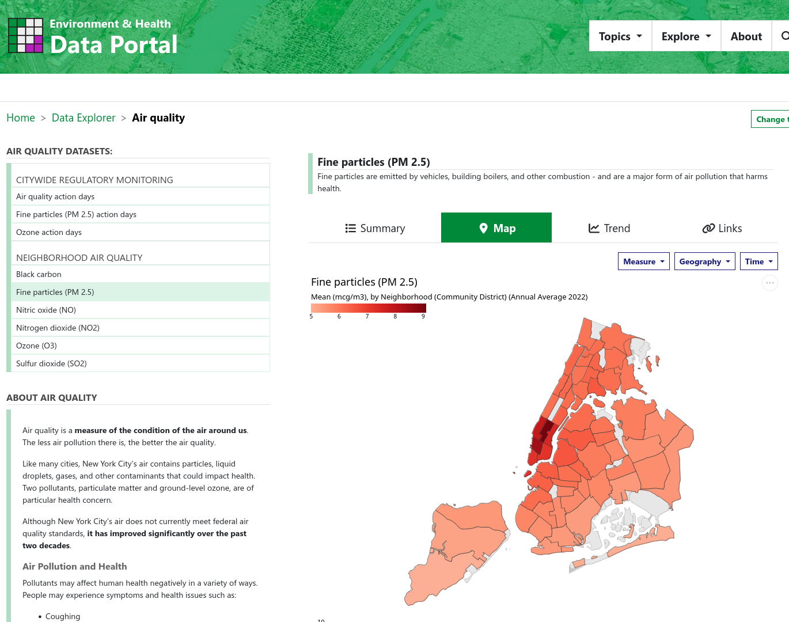

<!--
Compile with: pandoc -t beamer -s Mark-Torrey_intro-2-QGIS_slides.md -o Mark-Torrey_intro-2-QGIS_slides.pdf
-->

<!--
Title slide gets inserted here automatically, generated from yaml block. No separator necessary between title and first content slide.
-->

## What is **GIS**?

### An acronym, it stands for...

. . . 

**G**eographic **I**nformation **S**ystem

. . . 

### Why isn't it just called "mapping" software?

. . . 

"Geographic Information" more accurately describes what the software does: Think of it like an extension to your spreadsheet software that lets you look at your data from a geographic perspective (if your data includes a geographic component).

---

### GIS software you need to know the names of:
* GUI: 
    * ArcGIS: expensive commercial GIS software made by ESRI <!-- TODO: Add logos? --> 
    * QGIS: Open-source free ArcGIS work-alike software made by volunteers
* (R and Python: programming languages, also open-source)

---

## **NYC Environment & Health Data Portal --- PM 2.5 Map**

{ width=100% height=100% }

---

## **QGIS Main Window**

{ width=100% height=100% }

<!--
  If you omit width and height, the images tend to appear pixel-for-pixel at the resolution of the screen.  This often means: very huge. Pandoc can resize the images for you.
-->

:::::::::::::: {.columns}
::: {.column width="50%"}

1. Layers List / Browser Panel <!-- ^[https://docs.qgis.org/3.34/en/docs/training_manual/basic_map/overview.html] -->
2. Toolbars
3. Map canvas

:::
::: {.column width="50%"}

4. Status bar
5. Side Toolbar
6. Locator bar

:::
::::::::::::::

---

# Go to QGIS

<!-- TODO: URLs are breaking beamer, also for some reason this slide HAS to be here, along with this comment, or beamer breaks
## Other trainings:
- QGIS Training Manual: [https://docs.qgis.org/3.34/en/docs/training_manual/index.html](https://docs.qgis.org/3.34/en/docs/training_manual/index.html)

## Data sources: 
1. Download CD geography from NYC open data: [https://data.cityofnewyork.us/City-Government/Community-Districts/yfnk-k7r4](https://data.cityofnewyork.us/City-Government/Community-Districts/yfnk-k7r4)
2. Download PM 2.5 data by CD from NYC environmental health portal: [https://a816-dohbesp.nyc.gov/IndicatorPublic/data-explorer/air-quality/?id=2023#display=map](https://a816-dohbesp.nyc.gov/IndicatorPublic/data-explorer/air-quality/?id=2023#display=map)
3. Download hospital location points from NYS: [https://health.data.ny.gov/Health/Health-Facility-General-Information/vn5v-hh5r/about_data](https://health.data.ny.gov/Health/Health-Facility-General-Information/vn5v-hh5r/about_data)
-->

